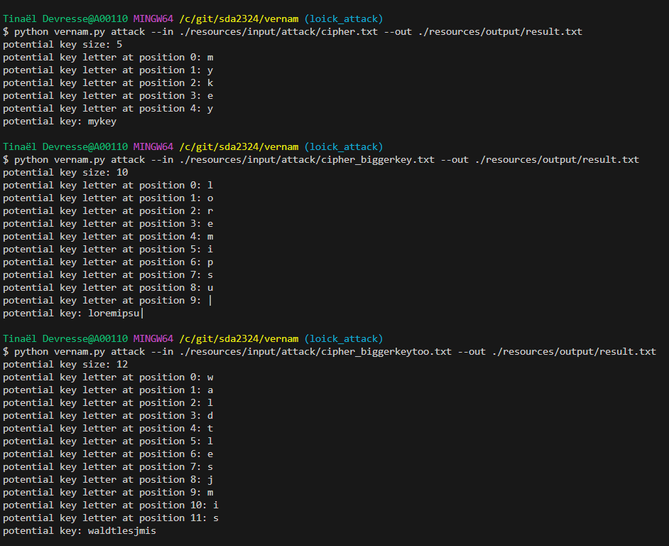
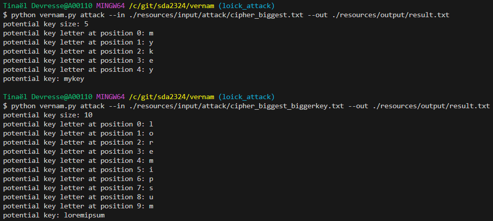
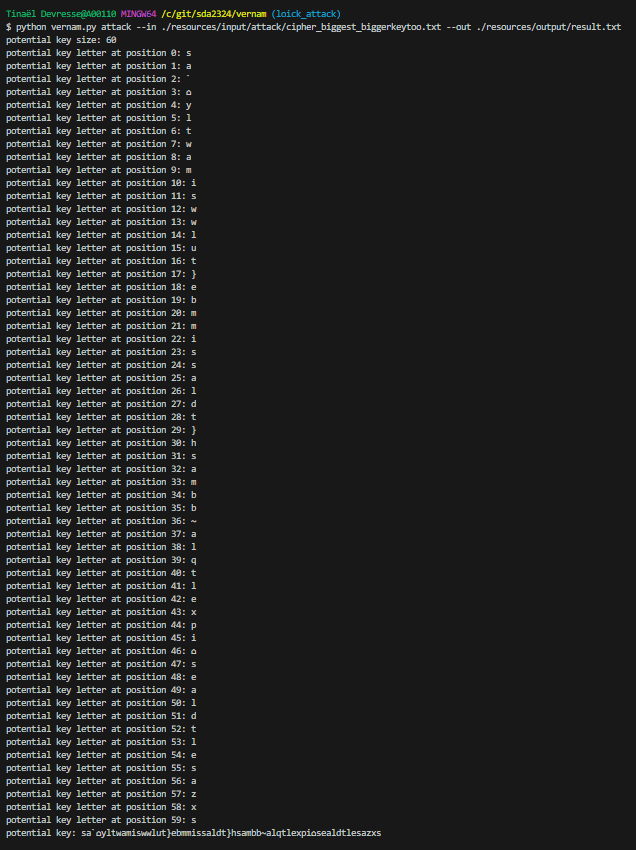

# SDA 2023-2024
MASI course asset "Sécurité des Applications".
Topic on frequency analysis.

## Getting started

Install the requirements with the follwoing commands:
```bash
$ python -m venv venv
$ source venv/bin/activate
$ pip install -r requirements.txt
```

## Running the CLI

As stated in the documentation, the CLI has several options.
You can visualize them by running the CLI with the following command :
```bash
$ python vernam.py --help
```

Several commands are available, with their batch of options. **Please carefully read the docs before using.**

⚠️ In regard to the instructions of this exercise, a slight difference is to be noted. The parameters `--encrypt` and `--decrypt` are __not__ parameters in this version of the program.
Wich means you should use them with the `--` !

### Encrypt

The used command to validate the encryption feature is **`python vernam.py encrypt --in ./resources/input/encrypt/plain.txt --out ./resources/output/cipher.txt --key mykey`**.

### Decrypt

The used command to validate the decryption feature is **`python vernam.py decrypt --in ./resources/input/decrypt/cipher.txt --out ./resources/output/plain.txt --key mykey`**.

### Attack

The used command to validate the attack feature is **`python vernam.py attack --in ./resources/input/attack/cipher.txt --out ./resources/output/plain_attack.txt`** (the key was `mykey`, length of 5).

The used command to validate the attack feature with a bigger key is **`python vernam.py attack --in ./resources/input/attack/cipher_biggerkey.txt --out ./resources/output/plain_biggerkey.txt`** (the key was `loremipsum`, length of 10).

The used command to validate the attack feature with a bigger key is **`python vernam.py attack --in ./resources/input/attack/cipher_biggerkeytoo.txt --out ./resources/output/plain_biggerkeytoo.txt`** (the key was `salutlesamis`, length of 12).

> **Remark**
>
> We determined that bigger the text, bigger the key can be. But if we use a bigger key, the text must be bigger too otherwise
> the algorithm is gonna miscalculate the key thus resolving into unreadable plain text.

| Nom du fichier    	| Nom du fichier chiffré          	| Clé employée 	| Taille du texte (en caractères) 	| Taille de la clé (en caractères) 	| Résultat de l'attaque                  	|
|-------------------	|---------------------------------	|--------------	|---------------------------------	|----------------------------------	|----------------------------------------	|
| plain.txt         	| cipher.txt                      	| mykey        	| 2687                            	| 5                                	| OK                                     	|
| plain.txt         	| cipher_biggerkey.txt            	| loremipsum   	| 2687                            	| 10                               	| NOK (trouve 9/10 caractères de la clé) 	|
| plain.txt         	| cipher_biggerkeytoo.txt         	| salutlesamis 	| 2687                            	| 12                               	| NOK (trouve 9/12 caractères de la clé) 	|
| plain_biggest.txt 	| cipher_biggest.txt              	| mykey        	| 6634                            	| 5                                	| OK                                     	|
| plain_biggest.txt 	| cipher_biggest_biggerkey.txt    	| loremipsum   	| 6634                            	| 10                               	| OK                                     	|
| plain_biggest.txt 	| cipher_biggest_biggerkeytoo.txt 	| salutlesamis 	| 6634                            	| 12                               	| NOK (complètement)                     	|






## Contributors

[etu45363 - ARTS Loïck](https://gitlab.com/ArtsLoick45363)
[etu33784 - DEVRESSE Tinaël](https://gitlab.com/hunteroi)
